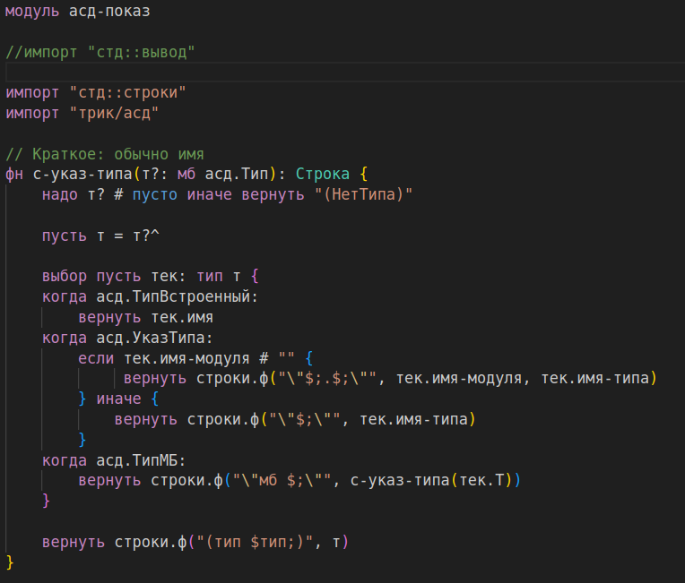

# Extension For Trivil Programming Language

This extension provides basic syntax highlighting for the Trivil programming language in Visual Studio Code.

## File Extension Support

- `.tri`

## Highlighted Elements

- Line comments (`//`)
- Block comments (`/* */`)
- Keywords and control statements (`авария`, `вернуть`, `вход`, `выбор`, `если`, `иначе`, `импорт`, `класс`, `конст`, `модуль`, `пока`, `прервать`, `пусть`, `тип`, `цикл`)
- Data Types (`Байт`, `Цел64`, `Слово64`, `Вещ64`, `Лог`, `Символ`, `Строка`, `Строка8`)
- Boolean constants (`ложь`, `истина`)
- Null constant (`пусто`)
- Double-quoted strings (`""`)
- Single-quoted characters (`''`)

## Example

---

Created by Nodir Bobiev at Innopolis University
